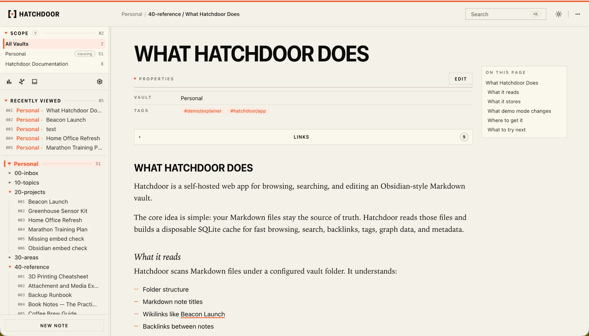
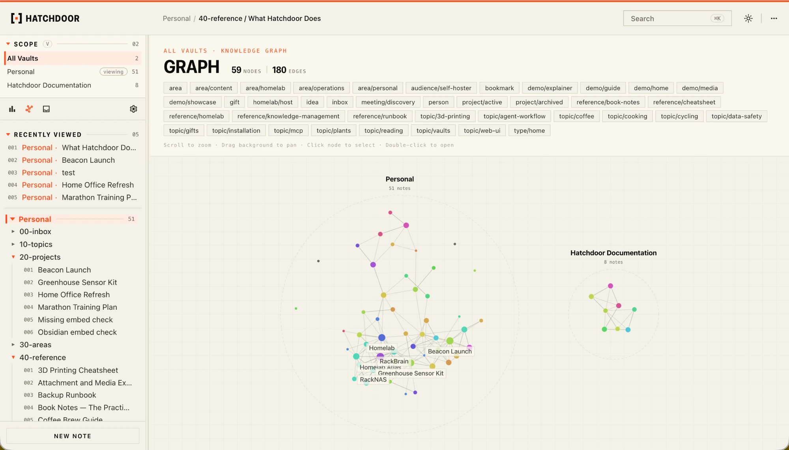
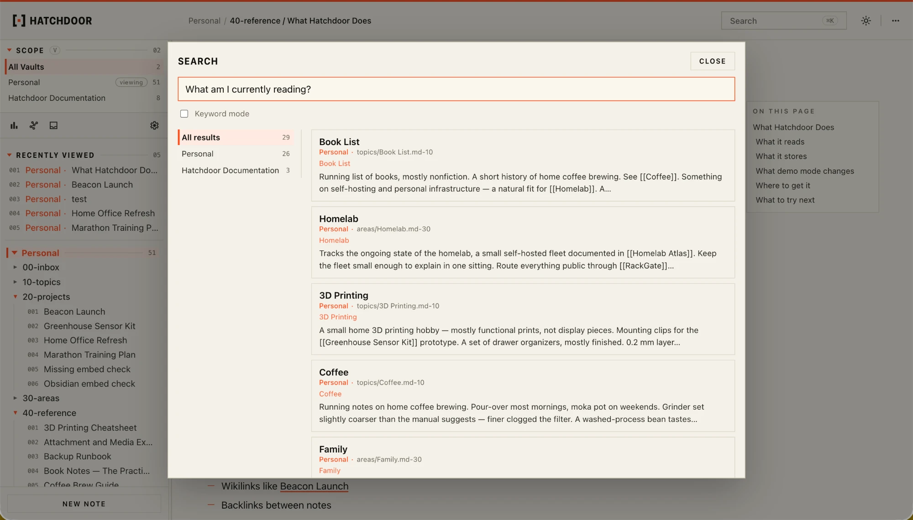
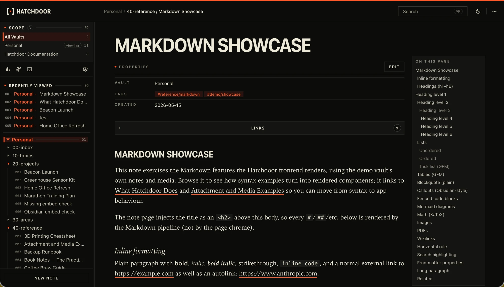
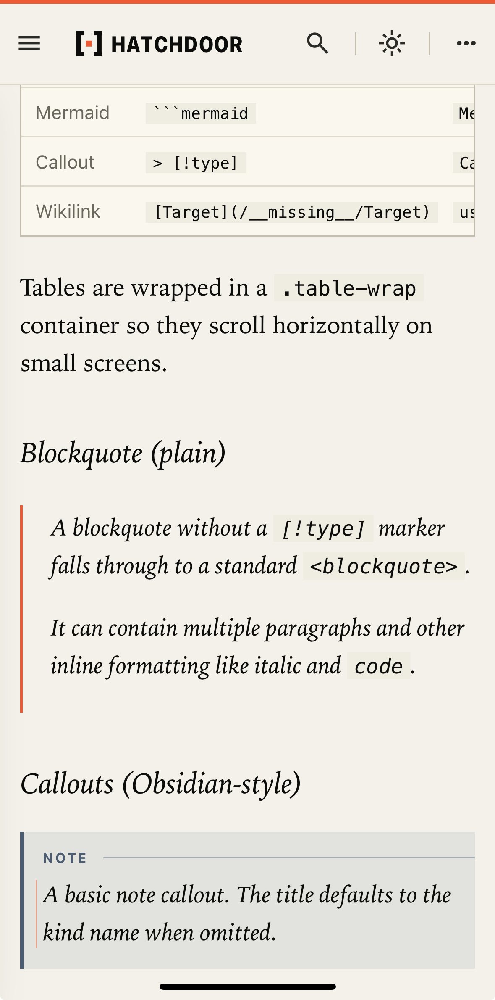

<p align="center">
  <picture>
    <source media="(prefers-color-scheme: dark)" srcset="assets/hatchdoor-wordmark-dark.png">
    
  </picture>
</p>

<p align="center">
  <a href="https://hatchdoor.battercloud.cc"></a>
  <a href="https://hub.docker.com/r/battermanz/hatchdoor"></a>
  <a href="https://github.com/BattermanZ/Hatchdoor/blob/main/Dockerfile"></a>
  <a href="LICENSE"></a>
</p>

# Hatchdoor

Hatchdoor is a self-hosted, **agent-native** web app for your Obsidian-style
Markdown vault. Browse, search, and edit your notes in a fast web UI, and give
AI agents first-class access to the very same vault over the Model Context
Protocol (MCP).

Point an MCP client like Claude, Claude Code, Codex, Cursor, or Hermes at
Hatchdoor and your agent can read, search (keyword and semantic), create, edit,
move, and link notes. Every action goes through the same safe, atomic vault
operations the UI uses, with optional automatic git commit-and-push. The web UI
and your agents are two front doors to one vault.

Your Markdown files stay the source of truth. Hatchdoor builds a disposable
SQLite read model for fast browsing, links, backlinks, keyword search, semantic
search, graph data, and metadata. If the cache is deleted, Hatchdoor rebuilds it
from the vault.

Hatchdoor was built with AI coding agents, primarily Claude Code and Codex,
under close human review, with tests and a documented safety model.

<p align="center">
  <a href="https://hatchdoor.battercloud.cc">
    
  </a>
</p>

<p align="center">
  <b><a href="https://hatchdoor.battercloud.cc">&#9654;&nbsp; Try the live demo</a></b>, a read-only public vault.
</p>

<details>
<summary><b>Contents</b></summary>

- [What You Get](#what-you-get)
- [Screenshots](#screenshots)
- [Who It Is For](#who-it-is-for)
- [Quick Start With Docker](#quick-start-with-docker)
- [Data And Safety Model](#data-and-safety-model)
- [Organizing a Vault for an LLM Wiki](#organizing-a-vault-for-an-llm-wiki)
- [Permissions](#permissions)
- [Configuration](#configuration)
- [Using Hatchdoor](#using-hatchdoor)
- [MCP Agent Access](#mcp-agent-access)
- [Git Sync](#git-sync)
- [Running Without Docker](#running-without-docker)
- [Troubleshooting](#troubleshooting)
- [API Reference](#api-reference)
- [Security Notes](#security-notes)
- [Development](#development)
- [Project Docs](#project-docs)
- [License](#license)

</details>

## What You Get

- A web UI for browsing folders and Markdown notes.
- Clean note URLs at `/n/:slug`.
- Obsidian-style wikilinks for `[[Note]]`, `[[Folder/Note]]`, and
  `[[Note|Alias]]`.
- Markdown rendering with GitHub-flavored Markdown, math, Mermaid diagrams,
  frontmatter, images, attachments, and broken-link styling.
- Keyword search and semantic search.
- Recent notes, backlinks, outbound links, stats, and graph views.
- Browser write support when the vault mount is writable.
- Attachment uploads, local asset serving, and inline previews for linked PDF
  vault assets.
- A first-class MCP server so AI agents can read, search, create, edit, and link
  notes with the same safety as the UI.
- Optional automatic git commits and pushes for Hatchdoor writes.
- PWA assets and service worker caching for common read paths.
- Distroless, rootless container image (no shell, runs as `nonroot`) that
  deploys with either Docker or Podman.

## Screenshots

<table>
  <tr>
    <td width="50%" valign="top">
      
      <p align="center"><sub><b>Knowledge graph</b>: notes, links, and tags</sub></p>
    </td>
    <td width="50%" valign="top">
      
      <p align="center"><sub><b>Semantic + keyword search</b></sub></p>
    </td>
  </tr>
  <tr>
    <td width="50%" valign="top">
      
      <p align="center"><sub><b>Dark mode</b></sub></p>
    </td>
    <td width="50%" valign="top" align="center">
      
      <p align="center"><sub><b>Responsive &amp; installable (PWA)</b></sub></p>
    </td>
  </tr>
</table>

## Who It Is For

Hatchdoor is useful if you have a folder of Markdown notes and want a private
web interface for them.

It is beginner-friendly enough to run with Docker Compose, but it also includes
advanced features for people who want agent access, git-backed vault sync,
semantic search, and local development.

Hatchdoor is not a hosted sync service, not a multi-user collaboration platform,
and not a replacement for Obsidian. It is a self-hosted companion for a Markdown
vault you control.

## Quick Start With Docker

### 1. Requirements

You need:

- Docker and Docker Compose (Podman and `podman compose` also work)
- A Markdown vault folder, or an empty folder if you want Hatchdoor to create a
  starter vault

### 2. Create Your Config

Copy the example environment file:

```bash
cp .env.example .env
```

The defaults create a starter vault beside the Compose file. To use an existing
vault, uncomment its host path in `.env`:

```env
HOST_VAULT_PATH=/absolute/path/to/your/markdown-vault
```

What these mean:

- `HOST_VAULT_PATH` is your Markdown vault on the host machine.
- `HOST_CACHE_PATH`, `HOST_STATE_PATH`, and `HOST_MODELS_PATH` are optional
  host-side locations for the generated cache, authoritative Vault registry,
  and downloaded models; Compose defaults them beside the project.

Before the first managed-Vault start, create the default authoritative state
directory with access for the image's numeric `nonroot` user. Docker otherwise
may create a missing bind source as root, leaving the registry unwritable:

```bash
mkdir -p data/state
chmod 700 data/state
sudo chown 65532:65532 data/state
```

For rootless Podman, use `podman unshare chown 65532:65532 data/state` instead
of `sudo chown`. Apply the same ownership rule to a custom `HOST_STATE_PATH`.

Do not add ordinary Settings values to `.env`: an unset value can be changed
live in Settings. See [Configuration](#configuration) for the few deployment
values that always remain environment-only.

### 3. Start Hatchdoor

```bash
docker compose up -d
```

Docker Compose binds Hatchdoor to a non-loopback container interface, so a
first run without a web token stops safely and prints a fresh, recoverable
token. Retrieve it with:

```bash
docker compose logs hatchdoor
```

Copy the printed `HATCHDOOR_WEB_BEARER_TOKEN=...` assignment into `.env`, then
start again with `docker compose up -d`. The token is deliberately not stored
by Hatchdoor; use the one from that refusal or generate a new long random token.
Once the server is running, open `http://localhost:42824` and enter it in the
browser prompt.

### 4. Choose Your Search Model

Hatchdoor images include no model weights. On the first launch, Hatchdoor asks
you to choose how semantic search is set up before it downloads anything.

- **Set up Gemma** is the default. EmbeddingGemma is multilingual and provides
  the best search quality. Read and accept the Gemma terms in the web UI (or
  through the first-run MCP setup tools); Hatchdoor then downloads the model,
  scans the vault, and builds the index automatically.
- **Use Nomic instead** declines Gemma and starts the same setup with Nomic
  Embed Text v1.5. It needs no Gemma acceptance, but it is English-only and is
  less suitable for multilingual vaults.

Accepting the Gemma terms only permits Hatchdoor to download and use that model.
It does not change ownership of your vault or its content, and Hatchdoor does
not send vault content anywhere. The downloaded model and the local acceptance
receipt stay in `HOST_MODELS_PATH`, so they persist across container restarts.

The UI and logs show download and indexing progress. Vault features remain
unavailable until setup is ready; if a model download fails, Hatchdoor presents
a retry action instead of silently changing models.

### 5. Container Image And Paths

The image is published on [Docker Hub](https://hub.docker.com/r/battermanz/hatchdoor):

```text
battermanz/hatchdoor:latest          # also version tags, e.g. 2.4.0
battermanz/hatchdoor:podman-latest   # for Podman users (podman-<version> too)
```

The runtime image is **distroless and rootless**. It is built on
`gcr.io/distroless/cc-debian13:nonroot`, ships no shell or package manager, and
runs as an unprivileged `nonroot` user. Hatchdoor also runs unchanged under
Podman (rootless included); swap `docker` / `docker compose` for `podman` /
`podman compose`.

Docker Compose mounts:

| Container path | Purpose |
| --- | --- |
| `/data/vault` | Markdown vault, source of truth |
| `/data/cache` | Generated SQLite cache |
| `/data/state` | Authoritative Vault identities and source definitions |
| `/models` | Downloaded search model and local Gemma terms receipt |

## Data And Safety Model

Hatchdoor is designed around a simple rule: your Markdown vault is the source of
truth.

- Markdown files live in `VAULT_PATH`.
- Vault identities and source definitions live in `/data/state/vaults.json`.
  A Vault's Git HTTPS credential is stored there too, so the file is created
  with `0600` permissions on Unix and belongs in a backup you treat as secret.
  The API never returns it: a Vault reports only `credential_configured`, and
  an edit that means to keep a stored secret says so with `https_credentials:
  {"action": "keep"}` rather than resending it.
- SQLite is a generated cache and can be rebuilt.
- The SQLite cache should live outside the vault.
- Hatchdoor scans `.md` files under the vault while excluding built-in and
  configured noise paths (including `.hatchdoor-trash`).
- Delete actions move notes and referenced assets into `.hatchdoor-trash`.
- Archive actions move notes under `HATCHDOOR_ARCHIVE_PREFIX`.
- Browser write actions are available only when the vault is writable.
- MCP is disabled by default.
- MCP requires its own bearer token whenever it is enabled.
- Versioning is off by default; it can keep local Git history or safely sync an
  existing remote.

Upgrading an existing single-Vault deployment requires persistent
`/data/state`; see the [legacy single-Vault upgrade
guide](docs/migrations/legacy-single-vault.md) for detection, recovery, and
rollback constraints.

If `VAULT_PATH` contains no Markdown files, Hatchdoor creates a small starter
vault before the first index build. Existing vaults are not seeded or modified
by this startup step (the `.hatchdoor-trash` folder is ignored when deciding
whether a vault is empty).

The starter vault lays out a lightweight PARA-style structure with index notes
and onboarding references:

```text
README.md
10-topics/Topics Index.md
20-projects/Projects Index.md
30-areas/Areas Index.md
40-reference/Hatchdoor — Getting Started.md
40-reference/Hatchdoor — Agent Guide.md
40-reference/Hatchdoor — Agent Skill.md
40-reference/Hatchdoor — Markdown Feature Showcase.md
40-reference/Hatchdoor — Starter Vault Organisation.md
```

These are ordinary notes you can edit, move, or delete like any other. The
reference notes double as onboarding docs, including a ready-to-use **agent
skill** template (see [MCP Agent Access](#mcp-agent-access)) for wiring an AI
agent to the vault through MCP.

## Organizing a Vault for an LLM Wiki

Hatchdoor works well with the [LLM Wiki pattern described by Andrej
Karpathy](https://gist.github.com/karpathy/442a6bf555914893e9891c11519de94f):
keep original source material separate from the Markdown wiki that an LLM
maintains.

A simple vault layout looks like this:

```text
vault/
├── raw/                    # Original articles, clips, transcripts, PDFs, etc.
│   └── .hatchdoor-layer     # Places raw files on their own Hatchdoor layer
├── wiki/                   # Markdown pages maintained by you or an LLM
└── AGENTS.md               # Optional instructions for the agent maintaining the wiki
```

### Put raw sources on a separate layer

Create this file inside the folder containing your raw source material:

```text
# raw/.hatchdoor-layer
raw
```

The file contents are the layer name. In this example, every Markdown note
under `raw/` belongs to the `raw` layer. It stays out of Hatchdoor's browser
interface and default search results, while MCP clients can explicitly select
it with `layers: ["raw"]`. Use a different name if you prefer, such as
`sources`, `research`, or `evidence`.

A layer is a visibility and search boundary; it does **not** make files
read-only. If raw sources must remain unchanged, state that rule in your agent
instructions (for example, `AGENTS.md` or `CLAUDE.md`).

### Do not confuse layers with exclusions

Use a layer when agents should still be able to read the files separately. In
**Settings → Vault → Ignore these files**, add this pattern only when Hatchdoor
should ignore the path completely:

```text
imports/,*.bak
```

Do **not** add `raw/` if agents need to search or read `raw/`: excluded files
are absent from Hatchdoor's index.

If your raw layer is large and you want to avoid creating vector embeddings for
it, turn off **Settings → Vault → Meaning search in demoted layers**.

The raw layer remains available for keyword lookup when an MCP client selects
it, without using vector-indexing resources.

## Permissions

The Docker image runs as a non-root user.

For read-only browsing:

- Mount the vault read-only if you want.
- Keep the cache directory writable.
- Keep the state directory writable whenever migration or Vault management may
  create or update the authoritative registry.

For browser writes, MCP writes, attachment uploads, or git sync:

- The vault mount must be writable by the container runtime user.
- The cache directory must be writable.
- The state directory must be writable.

If Hatchdoor starts but write features are disabled, check the permissions on
your vault mount and call `/api/write-capabilities` from an authenticated
browser session.

## Configuration

Copy `.env.example` to `.env`. Its values are all commented out: Docker Compose
and Hatchdoor supply the ordinary defaults, and Settings owns live server
configuration. A non-empty value for a server-wide Settings key in `.env` is
an intentional **environment pin**: it wins over the saved Settings value for
that process. Remove the pin and restart to make that setting editable in
Settings again. Vault definitions are managed per Vault through Settings, the
HTTP API, or MCP; their legacy single-Vault environment variables are accepted
only for the one-time migration described below.

### Deployment And Environment-Only Values

These values are not Settings controls. In Docker, Compose fixes the container
bind address, port, vault path, and cache path to match its port and volume
contract; change `docker-compose.yml` as one deployment change if you need a
different container layout.

| Variable | Default | How to manage it |
| --- | --- | --- |
| `HOST_VAULT_PATH` | `./vault` | Compose host mount input; set in `.env` for an existing vault |
| `HOST_CACHE_PATH` | `./data/cache` | Compose host mount input |
| `HOST_STATE_PATH` | `./data/state` | Compose host mount for authoritative Vault registry state; preserve across upgrades |
| `HOST_MODELS_PATH` | `./models` | Compose host mount input |
| `VAULT_PATH` | `./vault` directly; `/data/vault` in Compose | Environment-only runtime path |
| `HATCHDOOR_CACHE_DB` | `./data/cache/hatchdoor-cache.sqlite3` directly; `/data/cache/hatchdoor-cache.sqlite3` in Compose | Environment-only runtime path |
| `HOST` / `PORT` | `127.0.0.1` / `42824` directly; `0.0.0.0` / `42824` in Compose | Environment-only bind contract |
| `HATCHDOOR_SETTINGS_FILE` | beside the cache database | Environment-only override for the durable Settings file |
| `HATCHDOOR_WEB_BEARER_TOKEN` | empty | Environment-only web credential |
| `HATCHDOOR_DEMO_MODE` | `false` | Environment-only public read-only mode |
| `RUST_LOG` | `hatchdoor=info,tower_http=info,axum::rejection=warn` | Environment-only logging filter |

### Settings: Live Values And Environment Pins

The following values are editable in **Settings** and apply to the running
server without a restart. If a non-empty `.env` value is present, Settings
shows it as **Set in .env** and does not allow an in-browser edit. That is how
to deliberately keep a value deployment-managed.

| Settings section | Variables | Apply behavior |
| --- | --- | --- |
| Vault | `HATCHDOOR_ARCHIVE_PREFIX` | Applies immediately |
| Notes handling | `HATCHDOOR_EMBED_LAYERS` | Requires confirmation, then rebuilds the search index in the background; search keeps using the previous coherent index until it is ready |
| Agent access (MCP) | `HATCHDOOR_MCP_ENABLED`, `HATCHDOOR_MCP_WRITE_ENABLED`, `HATCHDOOR_MCP_BEARER_TOKEN`, `HATCHDOOR_MCP_ALLOWED_ORIGINS` | Applies immediately to new MCP requests |
| Uploads | `HATCHDOOR_MAX_ATTACHMENT_BYTES`, `HATCHDOOR_MCP_MAX_BASE64_BYTES` | Applies immediately |

`HATCHDOOR_EXCLUDE` and every `HATCHDOOR_GIT_*` variable are import-only
legacy inputs, not live settings or deployment pins. Keep them for the first
upgraded start so Hatchdoor can migrate the old Vault, then remove every key
named by the startup refusal and restart.

Settings saves its live values, including configured MCP and Git tokens, in a
durable `settings.json` beside the cache database (or at
`HATCHDOOR_SETTINGS_FILE`). The file is created with `0600` permissions on
Unix; secret values are never returned in the Settings document. The file is an
implementation detail: use the page, not hand edits, to change live
configuration.

### Web Authentication

When `HATCHDOOR_WEB_BEARER_TOKEN` is set, protected requests must send:

```text
Authorization: Bearer <token>
```

The bundled PWA stores the token locally after a `401` response and attaches it
to API calls. For image, download, and server-sent-event URLs where headers
cannot be set, the frontend appends an `access_token` query parameter.

Hatchdoor refuses to start with `HOST=0.0.0.0` or another non-loopback bind
unless `HATCHDOOR_WEB_BEARER_TOKEN` is set. On this refusal it prints a freshly
generated token and the `.env` assignment to use; copy it into `.env` and
restart. The token is not persisted, so use the value printed by that refusal
or generate a new long random token yourself.

For a public test instance that people can browse without credentials, use demo
mode:

```env
HATCHDOOR_DEMO_MODE=true
```

Demo mode is intentionally read-only. It disables browser write operations and
the manual `/api/refresh` reindex, reports writes as unavailable through
`/api/write-capabilities`, and refuses to start if MCP or automatic git sync are
enabled.

Demo mode does not rate-limit requests. Search computes an embedding per query
and note downloads bundle attachments in memory, so an anonymous visitor can
generate real CPU and memory load. Put a public demo behind a rate-limiting
reverse proxy (e.g. nginx `limit_req`, Caddy `rate_limit`, or Traefik
`rateLimit` middleware) before exposing it to the internet.

### Indexing Changes

Use the **Vault** section of Settings to choose the archive folder, exclusion
patterns, and whether demoted layers receive semantic embeddings. Exclusions
use comma-separated gitignore syntax. Changing exclusions or layer embedding
requires confirmation because Hatchdoor starts a background reindex; it never
stops search just to apply the change.

## Using Hatchdoor

### Browsing

Hatchdoor builds a folder explorer from your vault folders and Markdown files.
The UI root is named `Vault`. Folder names come directly from your filesystem;
Hatchdoor does not require a PARA, Zettelkasten, or numbered folder scheme.

### Vault Layers And Exclusions

A folder can place its notes on a named, demoted layer by adding a
`.hatchdoor-layer` file. The smallest useful marker is a YAML scalar:

```text
# sources/.hatchdoor-layer
sources
```

Every Markdown note below `sources/` is then assigned to the `sources` layer.
It is absent from the browser tree, browser search, and other default-surface
results, while remaining available to trusted MCP clients that explicitly select
that layer. A mapping marker can add an operator-facing description:

```yaml
name: sources
description: Ground-truth clips and reference material.
```

Nested markers override their parent. Use `name: default` in a nested folder to
bring that subtree back to the default surface. Named markers cannot live at the
vault root, and `default`, `all`, `noise`, and `none` cannot be layer names.

MCP read and search tools default to the default surface. Pass
`layers: ["sources"]` to select one named layer, `layers: ["default",
"sources"]` to include both, or `layers: ["all"]` for every layer. `get_note`
can fetch a known note by slug or vault-relative path regardless of its layer.
The browser intentionally has no layer selector.

Noise patterns prevent files from entering the index. Hatchdoor always excludes
`.obsidian/`, `.trash/`, `.hatchdoor-trash/`, `.DS_Store`, `*.tmp`, and
`*.sync-conflict-*`; `.hatchdoor-layer` files are always read even if a broad
pattern would otherwise match them. Add extra comma-separated patterns in
**Settings → Vault → Ignore these files**. For example:

```text
imports/,*.bak
```

Patterns use gitignore syntax and are applied after the built-ins, so a leading
`!` can reinstate a default pattern when needed:

```text
!*.sync-conflict-*
```

Writes to an excluded target are refused rather than creating a file that the
index would hide. Marker changes trigger a full reindex; if a malformed marker
causes startup indexing to fail, correcting it lets the vault watcher recover
without restarting the server.

To inspect the active rules, markers, layer counts, and conflicts, call
`GET /api/diagnostics` (optionally `?path=sources/Clip.md`). Diagnostics are
disabled in demo mode because they can reveal demoted paths; they have no
Vault-scoped MCP replacement.

### Note URLs And Links

Note slugs are generated from Markdown filenames. Duplicate filenames receive
unique suffixes so routes remain stable.

Supported wikilinks include:

```text
[[Note]]
[[Folder/Note]]
[[Note|Alias]]
```

Hatchdoor resolves links, backlinks, headings, tags, graph data, and broken-link
state into the SQLite cache.

### Search

Hatchdoor stores:

- Full Markdown content
- File metadata
- Tags and headings
- Wikilinks and backlinks
- FTS5 keyword search data
- sqlite-vec semantic vectors

A recursive vault watcher refreshes the cache after Markdown or asset changes.
Browser clients subscribe to `/api/vault-events` and reload visible data after a
refreshed revision is broadcast.

### Manual Cache Rebuild

If you want to rebuild the cache from scratch:

```bash
rm ./data/cache/hatchdoor-cache.sqlite3
docker compose restart hatchdoor
```

Adjust the path if you changed `HOST_CACHE_PATH`.

## MCP Agent Access

The embedded MCP endpoint is disabled by default. Enable it only for trusted
clients.

MCP requires a bearer token even in read-only mode because `/mcp` bypasses the
web auth layer and can expose the full vault. In **Settings → Agent access
(MCP)**, generate or enter an MCP password, turn on assistant access, and save.
Turn on write access separately only when assistants may create, edit, move,
delete, or attach files. These changes apply to new MCP requests immediately;
they do not require editing `.env` or restarting the container.

Register the endpoint with a Streamable HTTP MCP client:

```text
http://127.0.0.1:42824/mcp
```

Send:

```text
Authorization: Bearer <token>
```

### MCP Vault scope

Start every agent session with `list_vaults`; it returns immutable `vault_id`
values, collection/registry revisions, capabilities, status, and only a
redacted credential indicator. There is no selected or default Vault.
Collection reads (`search_notes`, `get_tree`, `get_stats`, `get_graph`, and
`recently_modified`) require `scope`, set to one Vault ID or `all`. Exact reads,
Markdown mutations, and controls of an existing Vault require `vault_id`.
Collection results include `scope`, `collection_revision`, `partial`, and
participants; agents should branch on structured error `code`, never text.

### Agent Skill

Hatchdoor ships with a ready-to-use **agent skill** for driving the vault
through MCP. When Hatchdoor seeds a starter vault it writes the template to
`40-reference/Hatchdoor — Agent Skill.md`; the source also lives at
[`docs/starter-vault/40-reference/Hatchdoor — Agent Skill.md`](docs/starter-vault/40-reference/Hatchdoor%20%E2%80%94%20Agent%20Skill.md).

Copy its `hatchdoor-vault` skill block into your agent's skills directory to
teach the agent Hatchdoor's conventions: search before editing, pass the
returned content hash on writes, prefer small edits, and let Hatchdoor manage
backlinks, moves, and git sync.

### Attachment Upload

Agents and the web UI upload attachments directly — no shared staging folder to
mount. Two paths cover the size/compatibility trade-off:

- **`POST /api/v1/vaults/{vault_id}/attachments`** (multipart) — the default. Used by the web UI and
  by any agent that can make an HTTP request (e.g. shell out to `curl`).
  Accepts the web bearer token regardless of MCP write mode. An MCP agent can
  reuse its MCP bearer token only while MCP and MCP writes are currently
  enabled. Capped by `HATCHDOOR_MAX_ATTACHMENT_BYTES` (default 10 MiB).
- **`import_attachment` MCP tool** — the fallback, for MCP clients that cannot
  make an out-of-band HTTP request. Sends the file bytes base64-encoded inline;
  works with any MCP client, but base64 rides inside the JSON-RPC message and
  gets unreliable as files grow. Capped by `HATCHDOOR_MCP_MAX_BASE64_BYTES`
  (default 5 MiB), measured on the decoded file.

Use **Settings → Uploads** to change either limit while Hatchdoor is running.
The `import_attachment` MCP fallback requires the same explicit `vault_id`.

## Versioning and Git Sync

Versioning is configured per Vault. In that Vault's Settings page, choose No
Git, Local history, Pull-only, or Two-way when the Vault's source supports the
behavior. Repository identity, branch, Vault subdirectory, credentials, poll
schedule, and commit identity live on the Vault definition rather than on the
server.

Local mode can initialise an untouched vault after one explicit confirmation;
this permanently creates its `.git` history folder and ignores Hatchdoor's
`data/` cache and `settings.json`. Switching away from remote mode also asks
for one confirmation before future commits stop being sent remotely.

Requirements:

- Local mode needs only a vault Git repository (Settings can create one).
- Pull-only and Two-way additionally require the configured branch and remote
  repository to match the Vault definition, plus credentials when the remote
  requires them.
- Merge conflicts are kept for human resolution on the server; Hatchdoor never
  force-checks out over uncommitted manual vault edits.

The `HATCHDOOR_GIT_*` family above is the legacy single-vault path. A Vault in
the registry carries its own versioning, set on that Vault in Settings, and a
server-wide answer cannot survive a second Vault. On a first start with no
registry those variables are read once to import an existing single-vault
deployment. Hatchdoor then refuses the next start until they are removed; on a
fresh install, set versioning per Vault instead and leave them unset. See
[`docs/migrations/legacy-single-vault.md`](docs/migrations/legacy-single-vault.md).

Use `list_vaults` to inspect each Vault's Git status, and `sync_vault` or
`retry_vault` (with that `vault_id`) for eligible managed-Git Vaults.

## Running Without Docker

If [`just`](https://github.com/casey/just) is installed, `just dev-start` builds
on top of the manual steps below to also track PIDs and prevent duplicate
servers or stale build-cache directories from piling up; `just dev-stop` shuts
both down cleanly, and `just --list` shows the rest (`dev-status`,
`dev-clean`, `prod-check`). See the `justfile` for what each recipe does. Build
artifacts are shared through the primary checkout across linked worktrees;
explicit `CARGO_TARGET_DIR`, `CARGO_HOME`, and `HATCHDOOR_TMPDIR` values can
override the portable defaults.

Otherwise, build the frontend once:

```bash
cd frontend
npm ci
npm run build
cd ..
```

Run the backend:

```bash
cargo run
```

By default, local source runs bind to `127.0.0.1:42824` and read `./vault`.
Point Hatchdoor at a real vault with:

```bash
VAULT_PATH=/path/to/notes cargo run
```

For frontend dev mode:

```bash
# terminal 1
cargo run

# terminal 2
cd frontend
npm run dev
```

The first-run model choice also applies to local development. Hatchdoor stores
models in `./models` by default, so no model-prefetch command is required.

## Troubleshooting

### Hatchdoor refuses to start on `0.0.0.0`

Set `HATCHDOOR_WEB_BEARER_TOKEN`, bind to `127.0.0.1`, or enable
`HATCHDOOR_DEMO_MODE=true` for a read-only public demo.

This is intentional. A non-loopback bind can expose your vault to the network,
so Hatchdoor requires web authentication unless demo mode has disabled the app's
write surfaces.

### Docker starts, but the UI cannot write

Check that the mounted vault directory is writable by the container runtime
user. Browser write support depends on filesystem permissions.

### Cache errors or stale data

Delete the generated SQLite cache and restart:

```bash
rm ./data/cache/hatchdoor-cache.sqlite3
docker compose restart hatchdoor
```

### The app starts with a starter vault

Hatchdoor seeds starter notes only when `VAULT_PATH` contains no Markdown files.
If you expected an existing vault, this almost always means the container
mounted an empty directory, so double-check that `HOST_VAULT_PATH` in `.env`
resolves to your actual vault and isn't a typo or a stale Docker volume
shadowing the mount.

For the full list of notes Hatchdoor creates, see
[Data And Safety Model](#data-and-safety-model).

### MCP returns `401` or `403`

Check:

- `HATCHDOOR_MCP_ENABLED=true`
- `HATCHDOOR_MCP_BEARER_TOKEN` is set
- The client sends `Authorization: Bearer <token>`
- Browser-originated MCP requests come from an allowed origin in
  `HATCHDOOR_MCP_ALLOWED_ORIGINS`

### Remote versioning does not push

Check:

- The vault is a git repository root.
- The current branch matches the branch configured on the Vault.
- The remote exists in the repo config.
- The HTTPS token can push.
- There are no merge conflicts waiting for manual resolution.

## API Reference

Common routes:

| Method | Path | Purpose |
| --- | --- | --- |
| `GET` | `/health` | Health check |
| `GET` | `/api/tree` | Folder and note tree |
| `GET` | `/api/recently-modified` | Recently modified notes |
| `GET` | `/api/git-status` | Current versioning lifecycle and failure status |
| `GET` | `/api/note/:slug` | Read a note |
| `GET` | `/api/note/:slug/links` | Outbound links and backlinks |
| `GET` | `/api/note/:slug/download` | Download a Markdown export |
| `GET` | `/api/resolve?target=...` | Resolve one wikilink target |
| `POST` | `/api/resolve-batch` | Resolve multiple wikilink targets |
| `GET` | `/api/search?q=...` | Search notes |
| `GET` | `/api/stats` | Vault stats |
| `GET` | `/api/graph` | Graph data |
| `GET` | `/api/diagnostics` | Inspect layer and noise-exclusion diagnostics |
| `POST` | `/api/refresh` | Trigger cache refresh |
| `GET` | `/api/vault-events` | Server-sent vault revision events |
| `GET` | `/api/write-capabilities` | Check write availability |
| `POST` | `/api/note` | Create a note |
| `PUT` | `/api/note/:slug` | Update a note |
| `PATCH` | `/api/note/:slug/rename` | Rename a note |
| `PATCH` | `/api/note/:slug/move` | Move a note |
| `PATCH` | `/api/note/:slug/archive` | Archive a note |
| `PATCH` | `/api/note/:slug/move-rename` | Move and rename a note |
| `DELETE` | `/api/note/:slug` | Move a note to trash |
| `POST` | `/api/v1/vaults/{vault_id}/attachments` | Upload an attachment |
| `GET` | `/vault-assets/*path` | Serve vault assets |
| `POST` | `/mcp` | Streamable HTTP MCP endpoint |

## Security Notes

- Use a long random `HATCHDOOR_WEB_BEARER_TOKEN`.
- Do not expose Hatchdoor publicly without HTTPS in front of it.
- Use `HATCHDOOR_DEMO_MODE=true` only for browse-only public test instances.
- Keep MCP disabled unless you need it.
- Treat MCP write mode as powerful: it can create, edit, move, delete, and
  import content.
- Keep the SQLite cache outside the vault.
- Keep `.env` out of git.
- Review Docker volume paths before starting the container.

## Development

Backend checks:

```bash
cargo fmt --check
CARGO_BUILD_JOBS=1 cargo clippy --all-targets -- -D warnings
CARGO_BUILD_JOBS=1 cargo test
```

Frontend checks:

```bash
cd frontend
npm run format:check
npm run typecheck
npm run lint
npm test
npm run build
```

Build and publish the Docker image:

```bash
docker build -t battermanz/hatchdoor:latest .
docker tag battermanz/hatchdoor:latest battermanz/hatchdoor:2.4.0
docker push battermanz/hatchdoor:2.4.0
docker push battermanz/hatchdoor:latest
```

## Project Docs

- [Documentation index](docs/README.md): architecture, collaboration, roadmap,
  research, maintenance, and historical records.
- [Product roadmap](docs/roadmap/product-roadmap.md): draft overall product direction
  and the workstreams it breaks into.
- [Design system](docs/design/design-system.html): visual tokens, component patterns,
  layout rules, and interaction states used by the frontend.
- [Semantic search strategy](docs/adr/semantic-search-strategy.md): decision
  record for shipping pure semantic search instead of hybrid retrieval or a
  cross-encoder reranker in the runtime path.

## License

Hatchdoor is licensed under the GNU Affero General Public License v3.0 only.
See [LICENSE](LICENSE).

Third-party material — bundled icons, and the embedding models downloaded at
runtime — is recorded in [THIRD_PARTY_NOTICES](THIRD_PARTY_NOTICES.md).
