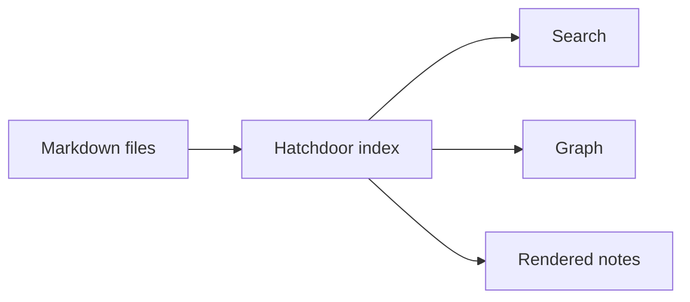

# Hatchdoor — Markdown Feature Showcase

This note demonstrates Markdown features that Hatchdoor renders. Use it as a quick visual test after changing styling or rendering code.

## Inline formatting

Plain text can include **bold**, *italic*, ***bold italic***, ~~strikethrough~~, `inline code`, and links such as <https://example.com>.

Raw HTML is not part of the supported Markdown contract. Keep notes portable by using Markdown syntax where possible.

## Headings

# Heading level 1
## Heading level 2
### Heading level 3
#### Heading level 4
##### Heading level 5
###### Heading level 6

Headings receive generated IDs so the table of contents and heading links can target them.

## Lists

Unordered lists:

- First item
- Second item
  - Nested item
  - Another nested item
- Third item

Ordered lists:

1. First step
2. Second step
   1. Sub-step
   2. Another sub-step
3. Third step

Task lists:

- [x] Finished task
- [ ] Open task
- [ ] Another open task

## Tables

| Feature | Markdown trigger | Notes |
|---|---|---|
| Wikilink | `[[Note]]` | Links to another note |
| Callout | `> [!note]` | Obsidian-style callout |
| Mermaid | fenced `mermaid` block | Diagram rendering |
| Math | `$...$` or `$$...$$` | KaTeX rendering |

Tables scroll horizontally on small screens.

## Blockquotes

> A normal blockquote is useful for excerpts, quoted text, or notes that need visual separation.

## Callouts

> [!note]
> A note callout for neutral information.

> [!info] Custom title
> An info callout with a custom title.

> [!tip]
> A tip callout for practical suggestions.

> [!warning]
> A warning callout for things to check before acting.

> [!danger]
> A danger callout for destructive or risky actions.

> [!success]
> A success callout for completed outcomes.

> [!question]
> A question callout for open decisions.

> [!example]
> An example callout for sample content.

> [!summary]+
> A collapsible summary callout that starts open.

> [!abstract]- Click to expand
> A collapsible abstract callout that starts closed.

## Code blocks

```bash
set -euo pipefail
echo "Hello from Hatchdoor"
```

```js
function greet(name) {
  return `Hello, ${name}`;
}
```

```rust
fn main() {
    println!("Hello from Hatchdoor");
}
```

```
Plain fenced block with no language.
```

## Mermaid



## Math

Inline math: $a^2 + b^2 = c^2$.

Block math:

$$
\int_{-\infty}^{\infty} e^{-x^2} \, dx = \sqrt{\pi}
$$

## Images

Use local Markdown image syntax:

```markdown

```

Store images near the note when possible, and use safe filenames with lowercase ASCII letters, numbers, and hyphens.

## PDFs

An ordinary Markdown PDF link is marked as a document and opens in a new tab: [Open the PDF preview sample](pdf-preview-sample.pdf).

The same local attachment can be embedded with Obsidian syntax. It renders an inline, responsive preview with page controls:

![[pdf-preview-sample.pdf]]

## Wikilinks

- Plain wikilink: [[Hatchdoor — Getting Started]]
- Aliased wikilink: [[Hatchdoor — Getting Started|start with the guide]]
- Heading wikilink: [[Hatchdoor — Getting Started#Search]]
- Intentional broken wikilink: [[Missing Demo Note]]

## Horizontal rule

---

Horizontal rules can divide long notes into sections.

---

## Frontmatter

Frontmatter is written at the top of a note:

```yaml
---
tags: [type/reference]
---
```

Hatchdoor parses frontmatter and can show properties separately from the note body.

## Related

- [[Hatchdoor — Getting Started]]
- [[Hatchdoor — Starter Vault Organisation]]
