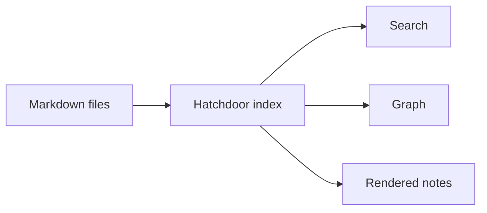

# Markdown feature showcase

This page uses every Markdown feature Hatchdoor renders, so you can see what each one looks like. [[Supported Markdown reference]] explains the syntax and the rules behind it; this page only shows the result. Open it in Help or copy it into a Vault, and you have a quick visual check after changing a theme or a stylesheet.

## Inline formatting

Plain text can include **bold**, *italic*, ***bold italic***, ~~strikethrough~~, `inline code`, and links such as <https://example.com>.

Raw HTML is not part of the supported Markdown contract. Keep notes portable by using Markdown syntax where possible.

## Headings

The page title above is a level 1 heading, and each section on this page is level 2. The rest look like this:

### Heading level 3
#### Heading level 4
##### Heading level 5
###### Heading level 6

Every heading gets an ID, which is what lets the table of contents and a heading wikilink jump to it.

## Lists

Unordered lists:

- First item
- Second item
  - Nested item
  - Another nested item
- Third item

Ordered lists:

1. First step
2. Second step
   1. Sub-step
   2. Another sub-step
3. Third step

Task lists:

- [x] Finished task
- [ ] Open task
- [ ] Another open task

## Tables

| Feature | Markdown trigger | Notes |
|---|---|---|
| Wikilink | `[[Note]]` | Links to another note |
| Callout | `> [!note]` | Obsidian-style callout |
| Mermaid | fenced `mermaid` block | Diagram rendering |
| Math | `$...$` or `$$...$$` | KaTeX rendering |

On a small screen a wide table scrolls sideways instead of breaking the page.

## Blockquotes

> A normal blockquote is useful for excerpts, quoted text, or notes that need visual separation.

## Callouts

> [!note]
> A note callout for neutral information.

> [!info] Custom title
> An info callout with a custom title.

> [!tip]
> A tip callout for practical suggestions.

> [!warning]
> A warning callout for things to check before acting.

> [!danger]
> A danger callout for destructive or risky actions.

> [!success]
> A success callout for completed outcomes.

> [!question]
> A question callout for open decisions.

> [!example]
> An example callout for sample content.

> [!summary]+
> A collapsible summary callout that starts open.

> [!abstract]- Click to expand
> A collapsible abstract callout that starts closed.

## Code blocks

```bash
set -euo pipefail
echo "Hello from Hatchdoor"
```

```js
function greet(name) {
  return `Hello, ${name}`;
}
```

```rust
fn main() {
    println!("Hello from Hatchdoor");
}
```

```
Plain fenced block with no language.
```

## Mermaid



## Math

Inline math: $a^2 + b^2 = c^2$.

Block math:

$$
\int_{-\infty}^{\infty} e^{-x^2} \, dx = \sqrt{\pi}
$$

## Images

The manual carries no pictures, so this section shows the syntax only. In a Vault, a local image is written like this:

```markdown

```

Keep the image near the note that uses it, and give it a safe filename: lowercase ASCII letters, numbers and hyphens.

## PDFs

The manual carries no PDFs either. In a Vault, an ordinary Markdown link to a local PDF, such as `[Open the report](report.pdf)`, gets a document marker and opens in a new tab. The Obsidian embed `![[report.pdf]]` instead shows the PDF inside the note, sized to fit, with buttons to move between pages.

## Wikilinks

- Plain wikilink: [[Connect your agent]]
- Aliased wikilink: [[Connect your agent|set up your agent]]
- Heading wikilink: [[Connect your agent#Configure your MCP client]]

A wikilink to a note that does not exist, such as `[[Missing Demo Note]]`, still renders in a Vault, as a link with nowhere to go yet. The manual only links to pages that exist, so it is shown here as code.

## Horizontal rule

---

Horizontal rules can divide long notes into sections.

---

## Frontmatter

Frontmatter is written at the top of a note:

```yaml
---
tags: [type/reference]
---
```

Hatchdoor reads frontmatter and shows the properties apart from the note body. This page has frontmatter too; Help leaves it out.

---

Related: [[Supported Markdown reference]] · [[How to edit notes with the live editor]]
