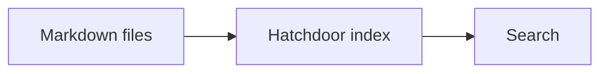

# Supported Markdown reference

A dictionary of the Markdown features Hatchdoor renders. Every note in a Vault is a plain `.md` file — this page shows what that file can contain and how Hatchdoor displays it.

## Inline formatting

Plain text can include **bold**, *italic*, ***bold italic***, ~~strikethrough~~, `inline code`, and links such as <https://example.com>.

Raw HTML is not part of the supported Markdown contract. Keep notes portable by using Markdown syntax where possible.

## Headings

`#` through `######` produce heading levels 1 through 6. Headings receive generated IDs, which is what makes a heading wikilink (below) and the table of contents work.

Those IDs, and the address a note itself answers to in the URL, are built the same way. An accent folds into the letter it sits on, so `## Café` is addressed as `cafe` and `## Straße` as `strasse`, while a heading in Cyrillic, Greek, Devanagari or a CJK script keeps its own letters rather than being spelled out in ASCII. Punctuation and symbols are dropped. Renaming a note to add or remove an accent leaves its address alone. A note whose name already carried one moved address when this rule landed, so a link to that note saved outside Hatchdoor may need updating.

## Lists

Unordered lists (`-`), ordered lists (`1.`), and nested lists at any depth are all supported. Task lists use `- [x]` (done) and `- [ ]` (open).

## Tables

```markdown
| Feature | Markdown trigger |
| --- | --- |
| Wikilink | `[[Note]]` |
| Callout | `> [!note]` |
```

Tables scroll horizontally on small screens rather than breaking layout.

## Blockquotes and callouts

A plain blockquote (`>`) is an ordinary quoted excerpt. A callout is a blockquote whose first line is `[!type]`, optionally followed by a custom title:

```markdown
> [!note]
> A note callout for neutral information.

> [!warning] Read this first
> A warning callout with a custom title.
```

Supported types: `note`, `info`, `tip`, `warning`, `danger`, `success`, `question`, `example`, `summary`, `abstract`, and likely others — the type controls the icon and color, not the rendering mechanism. Add `+` after the type to make it collapsible and start open, or `-` to start closed: `> [!summary]+`.

## Code blocks

Fenced code blocks (` ``` `) render with syntax highlighting when a language is given (` ```rust `, ` ```bash `, ` ```json `, and so on) and as a plain block when it's omitted.

## Mermaid diagrams

A fenced block with the `mermaid` language renders as a diagram instead of code:

````markdown

````

## Saved queries

A fenced block with the `base` language is a saved query: a description of which notes to list, written in part of the syntax Obsidian's Bases feature uses. The note page draws it as a table of the notes it selects, one row per note, each linking to that note:

````markdown
<!-- hatchdoor-query: active-subscriptions -->
```base
filters:
  and:
    - file.hasTag("type/entity/subscription")
    - 'finished == null || finished > now()'
views:
  - type: table
    name: Active subscriptions
    order:
      - file.name
      - price
      - billing_period
      - finished
```
````

The table is worked out each time the note is read, from the Vault the note lives in and no other. It is never written into the file, so search, backlinks, the graph and statistics see the block's text and not the rows, and another Markdown app shows the block itself. A filter comparing against `now()` therefore changes its answer as time passes, with no edit to any file. Rows come back sorted by note title; the definition cannot change that order.

What a saved query can contain:

- `filters`, at the top and on the view, each either one expression in quotes or an `and`, `or` or `not` list of them. `not` means none of the listed conditions holds. The two sets of filters must both hold.
- Expressions that compare a property with a value: `price > 10`, `status != "done"`, `finished == null`. A property is named bare (`price`), as `note.price`, or as `note["next-payment"]` when its name has a hyphen. The file itself is `file.name` (with `.md`), `file.basename` (without), `file.path` and `file.folder`. Values are quoted text, numbers, `true`, `false`, `null`, `now()` and `today()`. Comparisons are `==`, `!=`, `<`, `<=`, `>` and `>=`, combined with `&&`, `||`, `!` and parentheses. Dates are compared as written, so write them as `2026-09-18`.
- `file.hasTag("a", "b")` for notes carrying any of those tags or one nested under them, `file.inFolder("projects")` for notes in that folder or below it, and `price.isEmpty()` for a property that is missing or blank.
- One view, of `type: table`, with an optional `name` shown above the table, a `limit` on how many rows it shows, and `order`, the columns from left to right. Without `order` the table has one column, the file name. `file.tags` is also available as a column.

A property a note does not have counts as `null`: `finished == null` selects it, `status != "done"` selects it, and `price > 10` does not.

Anything else that could change which notes appear is refused rather than half applied. That includes formulas, `properties`, more than one view, `sort`, and any function not listed above. A refused block shows **Not evaluated** in place of its table, followed by a sentence naming the part Hatchdoor could not use, such as `daysUntil()` or a line of broken YAML.

Three things only change how the rows would be drawn, so Hatchdoor draws the table anyway, with every row it would otherwise show, and says under it what it left out: `groupBy` (the rows appear ungrouped), `summaries` (no summary row), and a view `type` other than `table`, such as `cards` or `list` (drawn as a table).

A block that is fine but matches no note shows **No matches.** and says it checked every note in the Vault, so it cannot be confused with a broken one. Click a column heading to sort that table by it: once for ascending, again for descending, a third time for the original order. The sort is only on your screen. It is not written into the note and a reload forgets it, the way Obsidian treats sorting. See [[How to troubleshoot common problems]] for the other messages a saved query can show.

An HTML comment of the form `<!-- hatchdoor-query: name -->` on the line before the block, with nothing but blank lines between them, gives the saved query a name. The name is lowercase letters, digits and hyphens and must be unique within the note. It is never shown on the page. A name that is not usable, or that two blocks share, gets a note under the table and the rows still appear, since a name never changes which rows qualify. A marker with no block after it gets a note where it sits. The marker sits outside the block on purpose, so the block stays exactly what Obsidian expects to read.

## Math

Inline math uses single `$...$`; block math uses `$$...$$` on its own lines. Both render with KaTeX.

## Images and PDFs

Local Markdown image syntax works as expected:

```markdown

```

Store an image near the note that references it, and use safe filenames — lowercase ASCII letters, numbers, and hyphens. A Markdown link to a local PDF is marked as a document and opens in a new tab: `[Open the report](report.pdf)`. The same attachment can instead be embedded inline, with page controls, using Obsidian's embed syntax: `![[report.pdf]]`.

## Wikilinks

Hatchdoor resolves `[[Note Title]]` to another note in the same Vault, and refreshes those links whenever Markdown changes. Five forms:

- Plain: `[[Connect your agent]]` → [[Connect your agent]]
- Aliased: `[[Connect your agent|connect an agent]]` — displays custom text
- Aliased inside a table cell: `[[Connect your agent\|connect an agent]]`. A bare `|` would end the cell, so the alias pipe is written escaped. Hatchdoor reads that backslash as syntax rather than as part of the note's name, so the link resolves, shows up in backlinks, and is rewritten by a rename like any other.
- Heading-scoped: `[[Connect your agent#Configure your MCP client]]` — links straight to a heading
- A wikilink to a note that doesn't exist yet still renders — it just has nowhere to go until that note is created: `[[This Note Does Not Exist Yet]]`

## Horizontal rule

Three hyphens (`---`) on their own line renders a horizontal rule, useful for dividing a long note into sections. (It's also frontmatter's delimiter — see below — so this only renders as a rule when it isn't at the very top of the file.)

## Frontmatter

A note may open with a YAML frontmatter block:

```yaml
---
tags: [type/reference]
status: current
---
```

Hatchdoor parses frontmatter and can show properties (tags, aliases, and arbitrary key/value pairs) separately from the note body, without them cluttering the rendered text.

## Tags

A note's tags come from two places. Anything listed under `tags:` in frontmatter counts, in whatever shape you write it, including plain words and numbers.

In the body, only a namespaced hashtag counts: `#area/health` and `#type/reference/draft` are tags, a bare `#todo` or `#1177` is not. The namespace requirement is what keeps ordinary prose, issue numbers, and headings out of your tag list.

Hashtags inside code are never tags, so a note that documents a tag convention does not get filed under it. That covers both a fenced block and an inline span written with backticks:

````markdown
```
#not/a-tag
```

Write it as `#not/a-tag` in your note.
````

An agent renaming a tag across the Vault with `rename_tag` goes by these same rules, so a hashtag in code is left as written.

---

Related: [[MCP tools reference]] · [[HTTP API reference]]
