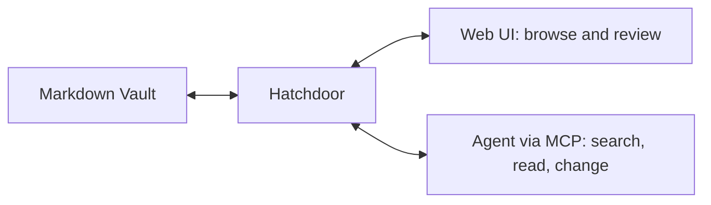

# Hatchdoor documentation

Hatchdoor is an agent-first notes app for Markdown Vaults you own. Connect an agent to search and change notes through Hatchdoor's guarded tools, then use the Web UI to read and review the same files. Markdown stays authoritative; Hatchdoor supplies the operational layer around it.

> [!tip]
> Start an agent read-only. It should search before it reads, read before it changes, and use the current note version when it saves.

## Start here

Follow [[Welcome to Hatchdoor]] to deploy Hatchdoor, connect your own agent, make one deliberate change, and review it in the browser. These docs target Hatchdoor v2.5.0.

> [!tip]
> Starting a new Vault and not sure how to organize it? Hatchdoor doesn't require any particular layout. Two established patterns worth knowing about: [[The PARA method (external reference)|PARA]] sorts folders by how actionable a note is (Projects, Areas, Resources, Archives); [[The LLM wiki pattern (external reference)|the LLM wiki pattern]] has an agent build and maintain an interlinked wiki for you. They aren't mutually exclusive — see [[How to run an LLM wiki in Hatchdoor]].

## Documentation areas

| Area | Purpose |
| --- | --- |
| **Get started** | Your first working Vault, agent, and browser session |
| **Guides** | Repeatable operational tasks |
| **Reference** | Configuration and API details |
| **Concepts** | How Hatchdoor stores, indexes, and protects notes |

Guides, Reference, and Concepts will grow from this starting point.

**Guides**

- [[How to deploy Hatchdoor with an agent]]
- [[How to set up a Git-backed Vault]]
- [[How to organize a Vault with layers]]
- [[How to run an LLM wiki in Hatchdoor]]
- [[How to troubleshoot common problems]]

**Reference**

- [[HTTP API reference]]
- [[MCP tools reference]]
- [[Supported Markdown reference]]
- [[Settings and environment variables reference]]
- [[The LLM wiki pattern (external reference)]]
- [[The PARA method (external reference)]]

**Concepts**

- [[The layer system]]
- [[How indexing and search work]]
- [[The security model]]
- [[Vault lifecycle states]]
