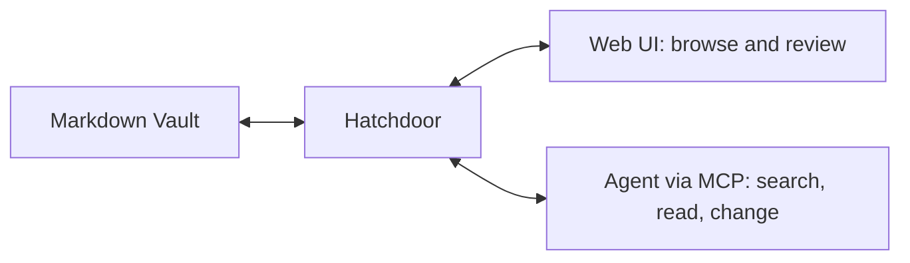

# Hatchdoor documentation

Hatchdoor is an agent-first notes app for Markdown Vaults you own. Connect an
agent to search and change notes through Hatchdoor's guarded tools, then use
the Web UI to read and review the same files. Markdown stays authoritative;
Hatchdoor supplies the operational layer around it.

> [!tip]
> Start an agent read-only. It should search before it reads, read before it changes, and use the current note version when it saves.

## Start here

Follow [[Welcome to Hatchdoor]] to deploy Hatchdoor, connect your own agent,
make one deliberate change, and review it in the browser. These docs target
Hatchdoor v2.5.0.

## Documentation areas

| Area | Purpose |
| --- | --- |
| **Get started** | Your first working Vault, agent, and browser session |
| **Guides** | Repeatable operational tasks |
| **Reference** | Configuration and API details |
| **Concepts** | How Hatchdoor stores, indexes, and protects notes |

Guides, Reference, and Concepts will grow from this starting point.
