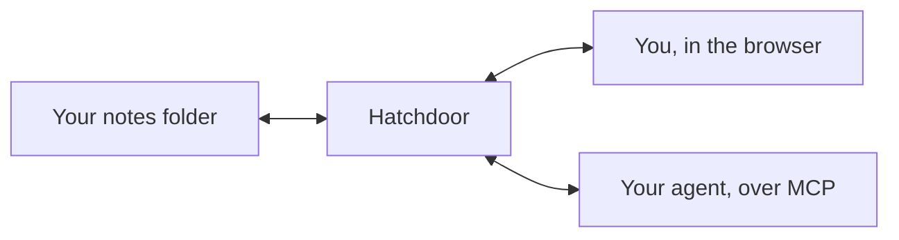

# Hatchdoor documentation

Hatchdoor puts your notes in one place that both you and an AI agent can use. Your notes stay ordinary Markdown files in a folder you own. You read and edit them in your browser, and an agent such as Claude Code or Codex searches and edits the same files through Hatchdoor's MCP connection.


```mermaid
flowchart LR
    V[Your notes folder] <--> H[Hatchdoor]
    H <--> W[You, in the browser]
    H <--> M[Your agent, over MCP]
```

> [!tip]
> Let your agent read before you let it write. Agent access starts read-only, and allowing changes is a separate switch you turn on when you are ready.

## Start here

If you are new to Hatchdoor, follow [[Welcome to Hatchdoor]]. It takes you from installing Hatchdoor to an agent that can search your notes, one page at a time.

If you have an AI agent that can run commands, such as Claude Code or Codex, it can do the install for you. Give it this one line, and [[How to deploy Hatchdoor with an agent]] tells it the rest:

```text
Read https://hatchdoor.battercloud.cc/docs/deploy.md and install Hatchdoor for me.
```

A fresh install opens on the **Set up Hatchdoor** checklist, which walks you through adding your notes, connecting your agent and trying a search. You can reopen it any time from **Help** → **Setup checklist**.

To look before you install anything, open the [public demo](https://hatchdoor.battercloud.cc), a live, read-only Hatchdoor with four example Vaults in it. Nothing there can be changed, so there is nothing to break.

When something is not working, [[How to troubleshoot common problems]] lists the usual problems: a forgotten password or token, an agent that cannot connect, notes not showing up, a Git sync that fails.

To see what changed in a release, read [[What's new]].

## Hatchdoor on the web

- The [public demo](https://hatchdoor.battercloud.cc) is a live, read-only Hatchdoor with four example Vaults.
- [This manual online](https://docs-hatchdoor.battercloud.cc) is the manual for the latest release, to read or share without an install. Help in your own Hatchdoor always shows the manual for the version you run.
- The [source code on GitHub](https://github.com/BatterWorks/Hatchdoor) comes with the [release notes](https://github.com/BatterWorks/Hatchdoor/releases) and the [issue tracker](https://github.com/BatterWorks/Hatchdoor/issues), where bug reports and requests go. Hatchdoor is free and open source under the AGPL-3.0 licence.
- The [Docker image](https://hub.docker.com/r/battermanz/hatchdoor) is on Docker Hub.

## Words used in this manual

- A **Vault** is one folder of Markdown notes that Hatchdoor knows about. You can have several.
- The **web token** is the password your browser asks for. It lives in your deployment's `.env` file.
- The **MCP password** (also called the MCP token) is the separate password your agent uses. You make it in **Settings** → **Agent access (MCP)**.
- **MCP** is the standard way AI agents connect to tools like Hatchdoor.

## Ways to organize your notes

Hatchdoor doesn't require any particular folder layout. If you want a starting point, [[How to choose a folder layout]] gives a simple one. If you want to read about the idea first, start with [[Why keep a second brain]]. These well-known methods all work, alone or mixed:

| Method | What it optimizes | Reference | See it live |
| --- | --- | --- | --- |
| **PARA** | Folders by how actionable a note is (Projects, Areas, Resources, Archives) | [[The PARA method (external reference)]] | [Home & Life](https://hatchdoor.battercloud.cc/v/919a41eb-a699-4d46-9857-eaa6db0a85c4/n/readme) |
| **Zettelkasten** | Dense links between small notes, few or no folders | [[The Zettelkasten method (external reference)]] | [Reading Notes](https://hatchdoor.battercloud.cc/v/7b6b865f-e5fa-4abd-8d1d-d5e75a7341f9/n/readme) |
| **LLM wiki** | An agent that builds and maintains an interlinked wiki for you | [[The LLM wiki pattern (external reference)]] | [Research Wiki](https://hatchdoor.battercloud.cc/v/e1f02552-5a8a-4a5e-9b75-4e40dd1cf141/n/readme) |

The demo's fourth Vault, [Team Docs](https://hatchdoor.battercloud.cc/v/ec49f950-6979-42e3-b31e-e1654e7716c5/n/readme), uses no folder convention at all and relies on tags and search instead. Every note in the demo is fictional. [[How to run an LLM wiki in Hatchdoor]] shows one way to combine an LLM wiki with folders underneath it.

## What's in this manual

| Section | What you'll find |
| --- | --- |
| **Get started** | Install Hatchdoor, add your notes, connect an agent, step by step |
| **Guides** | How to do one specific thing, such as setting up Git sync or upgrading |
| **Reference** | Every setting, API route, MCP tool and Markdown feature, in detail |
| **Concepts** | How Hatchdoor works underneath, for when you want to understand why |

**Get started**

- [[Welcome to Hatchdoor]]
- [[Install Hatchdoor with Docker Compose]]
- [[Connect your first Vault]]
- [[Connect your agent]]
- [[Search and change notes with your agent]]
- [[Browse and review through the Web UI]]
- [[Understand where your data lives]]

**Guides**

- [[How to deploy Hatchdoor with an agent]]
- [[How to upgrade Hatchdoor]]
- [[How to troubleshoot common problems]]
- [[How to work in a Vault as an agent]]
- [[How to set up a Git-backed Vault]]
- [[How to manage multiple Vaults]]
- [[How to choose a folder layout]]
- [[How to organize a Vault with layers]]
- [[How to run an LLM wiki in Hatchdoor]]
- [[How to import and work with attachments]]
- [[How to edit notes with the live editor]]

**Reference**

- [[HTTP API reference]]
- [[MCP tools reference]]
- [[Supported Markdown reference]]
- [[Markdown feature showcase]]
- [[Settings and environment variables reference]]
- [[Usage report reference]]
- [[The LLM wiki pattern (external reference)]]
- [[The PARA method (external reference)]]
- [[The Second Brain method (external reference)]]
- [[The Zettelkasten method (external reference)]]

**Concepts**

- [[What Hatchdoor is]]
- [[Why keep a second brain]]
- [[The layer system]]
- [[How indexing and search work]]
- [[The security model]]
- [[Vault lifecycle states]]
